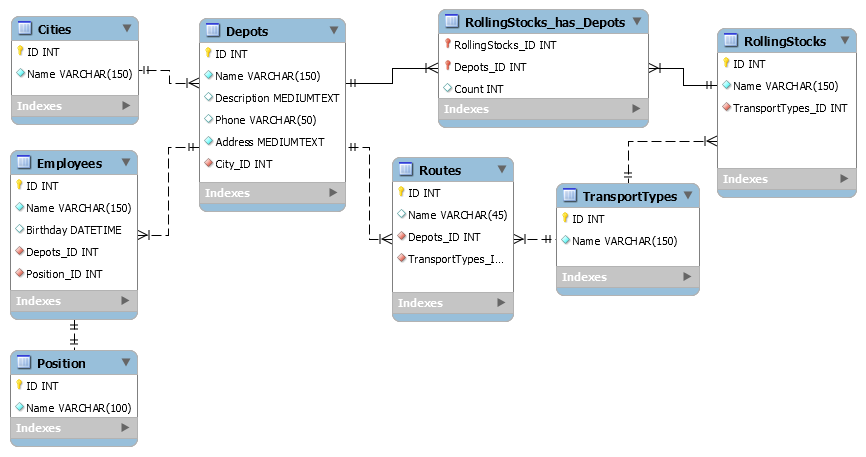

# Курсовая работа по базам данных

## Модель базы данных

## Фронтенд
Bootstrap, jQuery

## Бекенд
ASP.NET MVC

### Запуск

Просто опубликуйте проект через Visual Studio. Резервная копия базы данных находится в папке "SQL Backup".